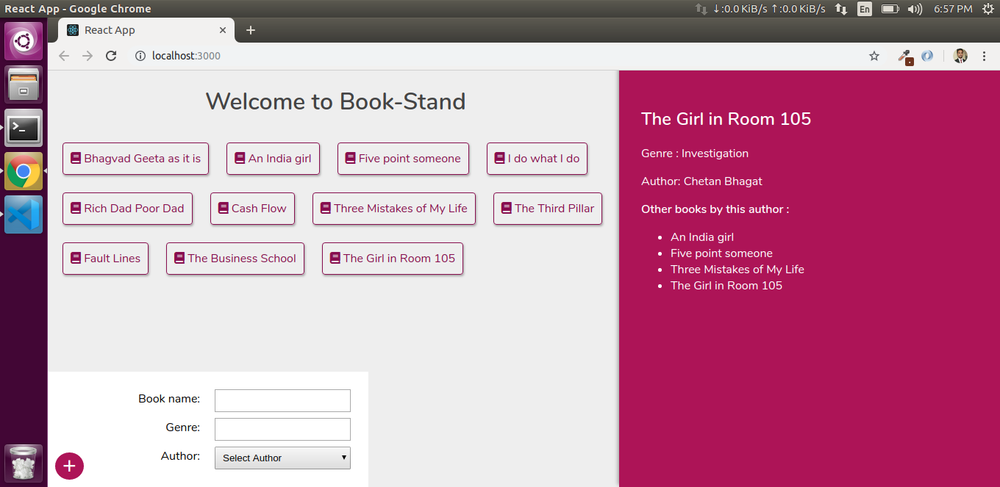

<h1 align="center">Book-Stand</h1>
Bookstand is a Full-Stack web-application built up with React JS in Front-End and Node JS, Express JS ad MongoDB in backend. In this App GraphQL also has been used with React as well as Express. One can Add a book with its genre and query it from front-end.

I have built this simple prototype app for implementing my learnings of GraphQL and NOdeJS. Please feel free to have a look at the source code and let me know your feedbacks.


### Tech

Bookstanf uses the following technologies: 

* [React JS] - React JS for single page front- end.
* [React-Apollo] - React-Apollo for querying data using GraphQL from front-end.
* [node.js] - evented I/O for the backend
* [Express] - fast node.js network app framework
* [MongoDB] - NoSQL Database for data persistence
* [GraphQL] - For flexible and efficient HTTP APIs.


### Installation

Bookstand requires [Node.js](https://nodejs.org/) v4+ to run.

clone the app.

> Run the server

Install the dependencies and devDependencies and start the server.

```sh
$ cd server
$ npm install
$ npm start
```

> Note: It will need to pass the mongo_db password in nodemon.json please use your own credentials.

> Run the client 

```sh
$ cd client
$ npm install
$ npm start
```
> cleint app runs at  http://localhost:3000

> server app runs at  http://localhost:4000

